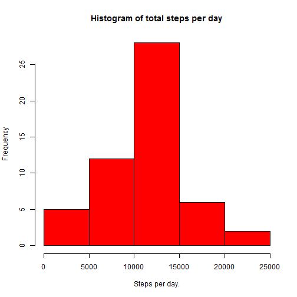
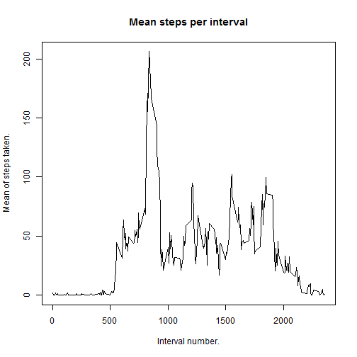
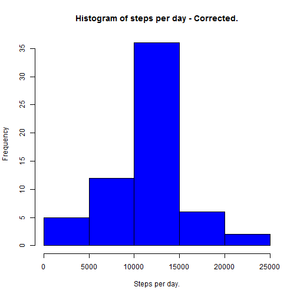
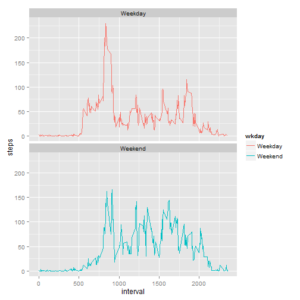

####Doc title: PA1_template.Rmd  
####author: TW  
####date: Thursday, August 13, 2015
####output: html_document
  
####Introduction.
It is now possible to collect a large amount of data about personal movement using activity monitoring devices such as a Fitbit, Nike Fuelband, or Jawbone Up. These type of devices are part of the "quantified self" movement - a group of enthusiasts who take measurements about themselves regularly to improve their health, to find patterns in their behavior, or because they are tech geeks. But these data remain under-utilized both because the raw data are hard to obtain and there is a lack of statistical methods and software for processing and interpreting the data.

This document makes use of data from a personal activity monitoring device. This device collects data at 5 minute intervals throughout the day. The data consists of two months of data from an anonymous individual collected during the months of October and November, 2012 and include the number of steps taken in 5 minute intervals each day.

Note:
The dataset is stored in a comma-separated-value (CSV) file and there are a total of 17,568 observations in all. 
The variables included in this dataset are:  
1. **steps**: Number of steps taking in a 5-minute interval (missing values are coded as NA)  
2. **date**: The date on which the measurement was taken in YYYY-MM-DD format  
3. **interval**: Identifier for the 5-minute interval in which measurement was taken  

####Loading and pre-processing the data.
Let's load some activity data - assuming that the required data file is in the current working directory.


```r
setwd("c:/RWD")                     # point to the working directory
fileName<-"activity.csv"            # create a file name var
activityTbl<-read.csv(fileName)     # read the file into the activityTbl var
```
Here's a peek at the data we've just loaded...

```r
head(activityTbl)
```

```
##   steps       date interval
## 1    NA 2012-10-01        0
## 2    NA 2012-10-01        5
## 3    NA 2012-10-01       10
## 4    NA 2012-10-01       15
## 5    NA 2012-10-01       20
## 6    NA 2012-10-01       25
```
You can see right from the start that there's some data missing. We'll correct that later, but for now let's move on.  

####What's the mean number of steps per day?  
Let's create a new table aggregating all of the steps by date and adding them together to produce a total number of steps for each full day in the data set. You can see some of the new table below:

```r
stepsPerDayTbl<-aggregate(steps~date, data=activityTbl, FUN=sum) 
head(stepsPerDayTbl)
```

```
##         date steps
## 1 2012-10-02   126
## 2 2012-10-03 11352
## 3 2012-10-04 12116
## 4 2012-10-05 13294
## 5 2012-10-06 15420
## 6 2012-10-07 11015
```
Not much to look at, so we'll plot it...

```r
hist(stepsPerDayTbl$steps,main="Histogram of total steps per day",xlab="Steps per day.",col="red")
```

 

```r
stepsPerDayMedian<-as.integer(median(stepsPerDayTbl$steps,na.rm=TRUE))   # calculate median no. of steps per day
stepsPerDayMean<-as.integer(mean(stepsPerDayTbl$steps,na.rm=TRUE))       # calculate mean no. of steps per day
print(paste('The mean number of steps per day is',stepsPerDayMean,': The median number of steps per day is',stepsPerDayMedian ))      #print out the mean and median values
```

```
## [1] "The mean number of steps per day is 10766 : The median number of steps per day is 10765"
```
  
####What's the daily average activity pattern?  

First we'll create a data set that will allow us to calculate and plot the mean number of steps per 5 minute interval across all of the days.

```r
AvgStepsPerInterval<-aggregate(steps~interval,data=activityTbl,FUN=mean)
```
Now let's plot the resulting table...

```r
plot(AvgStepsPerInterval,type="l", main="Mean steps per interval",xlab="Interval number.",ylab="Mean of steps taken.")
```

 
  
We can discover in which interval, on average, the most activity occurs:

```r
maxInterval<-AvgStepsPerInterval[AvgStepsPerInterval$steps==max(AvgStepsPerInterval$steps),]$interval
print(maxInterval)
```

```
## [1] 835
```
Apparently it's interval number 835.  
  
####Correcting missing values.  
Note that there are a number of days/intervals where there are missing values (coded as NA). The presence of missing values may introduce bias into some calculations or summaries of the data, so we need to correct this.  
First let's figure out how many missing values there are...

```r
NASum<-sum(is.na(activityTbl$steps)) # Create a logical vector identifying NAs, 
                                     # then sum the TRUEs
print(NASum)                         # print the result
```

```
## [1] 2304
```
It seems there are 2304 missing values in our data set.  
Our strategy for missing values will be to replace each NA with the average value for that segment as calculated earlier in the AverageStepsPerInterval table.  
First we'll create a working table. A duplicate of activityTbl.

```r
correctedTbl<-activityTbl     # push a copy of activityTbl to the correctedTbl var
```
Then, for each row in the new table that has a steps value of NA:  
1. Find the interval number of the missing entry.  
2. Replace the steps value with the average value gained from AvgStepsPerInterval at the same interval number.  


```r
for(i in 1:nrow(correctedTbl)){                       # check each row of correctedTbl
   if(is.na(correctedTbl[i,]$steps)){                 # if the steps value is NA...
      intervalNo<-correctedTbl[i,]$interval           # grab the interval number
      correctedTbl[i,]$steps<-AvgStepsPerInterval[AvgStepsPerInterval$interval==intervalNo,]$steps 
                                                      # replace with avg steps value for that interval
      }     
}
```
Taking a peek at the resulting correctedTbl...

```r
head(correctedTbl)
```

```
##       steps       date interval
## 1 1.7169811 2012-10-01        0
## 2 0.3396226 2012-10-01        5
## 3 0.1320755 2012-10-01       10
## 4 0.1509434 2012-10-01       15
## 5 0.0754717 2012-10-01       20
## 6 2.0943396 2012-10-01       25
```
We can see that the NAs have been replaced with appropriate average values.
Aggregating all of the steps by day and plotting the result we can see if our data substitution has made any significant difference.

```r
correctedStepsPerDayTbl<-aggregate(steps~date, data=correctedTbl, FUN=sum)
hist(correctedStepsPerDayTbl$steps,main="Histogram of steps per day - Corrected.",xlab="Steps per day.",col="blue")
```

 

```r
#
correctedStepsPerDayMean<-as.integer(mean(correctedStepsPerDayTbl$steps))
correctedStepsPerDayMedian<-as.integer(median(correctedStepsPerDayTbl$steps))
print(paste("Mean =",correctedStepsPerDayMean," : Median =",correctedStepsPerDayMedian))
```

```
## [1] "Mean = 10766  : Median = 10766"
```
Compared to our initial plot above, the mean and median values are now the same. 
  
####Are there differences in activity patterns between weekdays and weekends?  
Using the weekdays() function on the date var we can identify which dates fall on weekends and which don't. We use this information to form a factor variable called wkday.


```r
correctedTbl$wkday<-as.factor(ifelse(weekdays(as.Date(correctedTbl$date)) %in% c("Saturday","Sunday"),"Weekend","Weekday"))
```
Once the factors are established we can calculate the mean steps per interval for weekdays and weekends...  


```r
weMean<-as.integer(mean(correctedTbl[correctedTbl$wkday=="Weekend",]$steps))
wdMean<-as.integer(mean(correctedTbl[correctedTbl$wkday=="Weekday",]$steps))
```

And we can calculate the average steps per interval overall, keeping wkday as an identifying factor...  


```r
correctedAvgStepsPerInterval<-aggregate(steps~interval+wkday,data=correctedTbl,FUN=mean) 
                                          # calculate mean steps per interval keeping the wkday as a factor
```

And plot the resulting table using the ggplot2 package...  


```r
library(ggplot2)
p<-qplot(interval,steps,data=correctedAvgStepsPerInterval, geom="line",col=wkday)+facet_wrap(~wkday, ncol=1)
print(p)
```

 
  
  
The mean steps per interval on weekdays is 35.  
The mean steps per interval on weekends is 42.  
Showing that on average, activity is higher on weekends.


